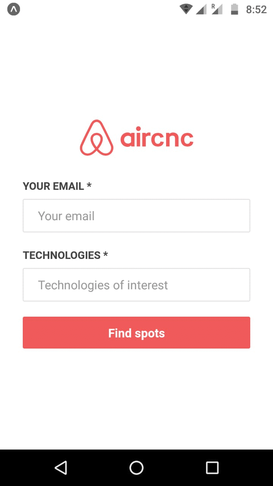

<h1 align = center>
    
</h1>

<h1  >
    
    
</h1>

# Indice
- [Sobre](#-sobre)
- [Tecnologias utilizadas](#-tecnologias-utilizadas)
- [Como baixar o projeto](#-como-baixar-o-projeto)

---

## 📃 **Sobre**

O projeto **Aircnc** é dividido em duas partes que será chamada de **Web** (se referindo a o site) e ao **mobile** (se referindo ao aplicativo).  A parte **Web** do projeto se resume na possibilidade do usuário, representante de uma empresa,
cadastrar espaços disponíveis em seu trabalho, com o intuíto de usuários (nesse caso, programadores) utilizem para adquirir mais conhecimento de tal área/tecnologia por um custo.
 
A parte **mobile** seria o ato do usuário programador escolher um spot (local disponibilizado pelas empresas) para utiliza-lo afim de aprender mais.

---

## 🛠 **Tecnologias utilizadas**

O projeto foi desenvolvido utilizando as seguintes tecnologias:

- Html
- CSS
- JavaScript
- Nodejs
- ReactJs
- MongoDB
 

--- 

 ## ⚙ **Requisitos**

Esses são os requisitos para rodar o projeto em sua máquina.

- Node.JS >= 10.16.2
- Yarn >= 1.17.3
- Expo >= 3.1.2
- NPM >= 6.9.0
  

---
## 🔧 Molde do site produzido por Rocketseat
---
### Desenvolvido por [Lucas de Abreu](https://github.com/Jornay) 